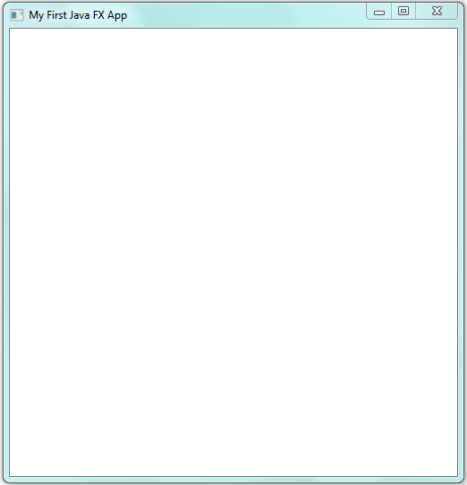

Building First Java FX App

# ***Introduction:***

Every Java FX app has at least one Stage, Scene and Node. In essence a
Stage is a container for a Scene and Scene contains the nodes which are
the smallest elements in a GUI application. Before making our First Java
FX it is important to introduce them briefly.

# ***Stage:***

A Stage is a built in class which is found in the package
***javafx.stage.Stage***. It is compulsory for every Java FX app to have
a stage. This compulsory stage is sometimes called "***Primary
Stage***". Although we can create our own custom stage but for simple
Java FX apps we will use ***Primary Stage*** which is provided by JAVA
FX RUNTIME.

# ***Scene:***

As stage is necessary for every Java FX. In addition to that there is
another important element needed by every Java FX app which is called
"Scene". It is also a built in class found in package
***javafx.scene.Scene***. Like Stage, every Java FX app must also have
at least one Scene. Scene is also sometimes called as "Scene Graphs".
Scene Graph and Scene are same things.

# ***Node:***

Recall that every Java FX app contains a Stage, and Stage contains a
Scene. This hierarchy does not ends here. Every Scene in turn consists
of at least one Node called "***Root Node***" or "***Parent Node***". A
scene can also have more than one Nodes. But Root Node is compulsory.
Root Node is usually the layout or Interface of a Java FX app. These
interfaces are packaged in ***javafx.scene.layout***. Some of the common
layouts are Grid Pane, Flow Pane, Anchor Pane, and Border Pane.

# ***Controls:***

As we know that beside Root Node there can also be other nodes which are
called ***child nodes***. These can be buttons, menu bar, status bars,
radio buttons, combo box and many more. These child nodes or Controls
are the basic elements of every GUI application. In Java FX they are
package in ***javafx.scene.controls***.

# ***The "Application Class":***

There is another important aspect to be discussed here about a Java FX
application that is the "Application Class". It is packaged in
***javafx.application.Application***. It provides us the some useful
methods that helpful to build and run a Java FX application. We will
discuss "Application Class and Life Time Methods" in next Manual.

The class which we will create for our Java FX application will always
extend or inherit Application Class. (As we will see a few moments later
in our code of First Java FX app.)

Also you should memorize this thing that we will always use two methods
in our Java FX app which are members of in "Application class" and are
declared in that class.

These are the "Start" and "Launch" methods.

The Start method is the method in which we will create layout, interface
and different scenes of our Java FX application. It takes a Stage as an
input parameter and has following general form:

***abstract void start (Stage primaryStage)***

Note that start method is abstract. This means our application should
must override it. In simple words it is compulsory for us to provide its
declaration (body) which is not provided in "Application Class".

The Launch method is used to run or launch the Java FX application. It
takes ***String ...args*** as an input parameter.

***public static void launch (String \... args)***

Also it is to be noted that Launch method will be called from inside
"main" method and the same "args" parameter of ***main*** will be passed
to launch method. Usually our main method will consist of only one
statement that is call to "launch" method.

*This space is left Blank Intentionally.*

# ***First Java FX Application:***

Now let us create our very first Java FX application.

import javafx.application.Application ;

import javafx.stage.Stage;

import javafx.scene.Scene;

import javafx.scene.layout.FlowPane;

public class myFirstJavaApp extends Application{

public static void main(String \[\]args){

launch (args);

} // end of main

public void start (Stage myStage){

myStage.setTitle("My First Java FX App");

FlowPane rootNode = new FlowPane();

Scene myScene = new Scene(rootNode,500,500);

myStage.setScene(myScene);

myStage.show();

} // end of Start

} // end of class "myFirstJavaApp"

# ***Output:***

Compilation and Execution of a Java FX application is similar to the
methods used to compile and execute a Simple Java Console Application.

> {width="5.4375in" height="5.645833333333333in"}

Note that the file name should match the name of class which contains
the main method as it is done in Simple Java Console Programs.
