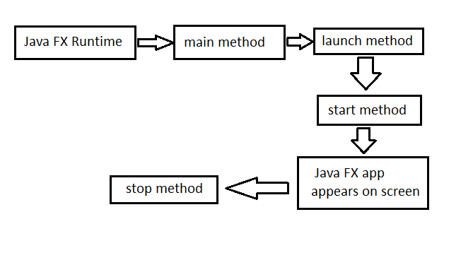
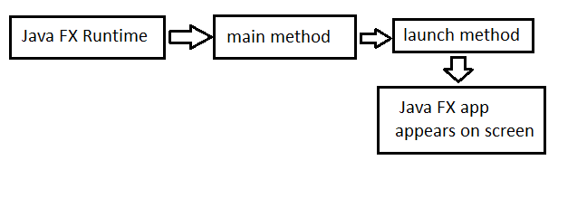
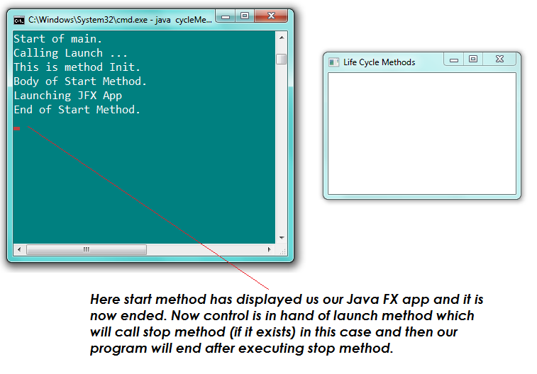
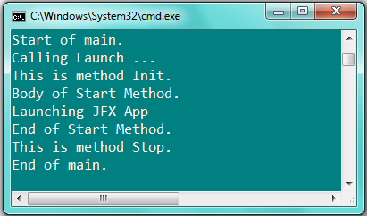

 to Life Cycle Methods

# ***The Application Class:***

Recall that every Java FX application should extend the "Application"
class found in package ***javafx.application.Application***. There are
some methods defined in this "Application" class which helps us in
building our Java FX application. These methods are called "***Life
Cycle Methods***". These four life cycle methods used are described
below.

# ***Life Cycle Methods:***

Life Cycle Methods are called "Life Cycle Methods" because they are
available throughout the execution of our Java FX application. These are
four in numbers. Two of them are compulsory to use and rest of the two
are optional to use.

Remember to use any of the Life Cycle Method you have to import
***javafx.application.Application*** because all the life cycle methods
are defined in "Application" class.

# ***The "Launch Method":***

The Launch method is used to run or launch the Java FX application. It
takes ***String ...args*** as an input parameter.

***public static void launch (String \... args)***

Also it is to be noted that Launch method will be called from inside
"main" method and the same "args" parameter of ***main*** will be passed
to launch method. Usually our main method will consist of only one
statement that is, call to a "launch" method.

# ***The "Initialization Method":***

This method is used to perform some tasks before starting a Java FX
application. That is it is used in Initialization of our Java FX app.
For Example sometimes you will want that before your JFX App starts,
every other opened window should be closed. For that purpose you can
write your code in body of the Initialization method. In short, it does
some necessary tasks defined by programmer before starting a Java FX
app***. It is not compulsory to use***. But you might find it in Real
World GUI applications.

The general form of Initialization Method is:

***public*** ***void init ( );***

It does not takes any parameter and does not returns anything.

# ***The "Start Method":***

Recall our First Java FX app. In start method, we use to create a scene
and add nodes (or Controls) to that scene. And at the end, we use to add
that scene to a Stage and set the Stage Visibility to On by calling
method ***myStage.show();***. Thus, ***start method is compulsory***
because in this method we define the interface and outlook of our GUI
app.

It takes a Stage as an input parameter and has following general form:

***abstract void start (Stage primaryStage);***

Note that start method is abstract. This means our application should
must override it. In simple words, it is compulsory for us to provide
its declaration (body) which is not provided in "Application Class".

# ***The "Stop Method":***

The stop method works similar to "Finalize Method" somehow (Garbage
Collection). The "Stop" method is used to perform some tasks that you
might want to be done after exiting or ending the execution of your Java
FX application. These tasks might include releasing the resource such as
Files. ***The "Stop" method is optional to use***. It is not compulsory
to use it. It has the following general form:

***public void stop ( );***

# ***Call Hierarchy of Life Cycle Methods and the Main Method:***

When we execute our Java FX app by using "***java***" command in Command
Prompt, we are actually calling ***Java FX Runtime*** (in console
program ***Java Runtime*** is called instead). The Java FX Runtime in
turn calls "***main***" method just as in simple programs Java Runtime
calls "main".

Note that in our main method of Java FX app we have only one statement
that is call to "***launch***" method which is responsible to launch our
Java FX app. But before starting our JFX app, method ***launch*** calls
"***init***" method if it is exists, to perform some necessary actions
as required before starting a Java FX app.

After that ***"Start"*** is called by ***launch*** which displays our
Java FX application and then the ***start*** method ends. At the end,
when we close a JFX app "***Stop***" method is called to perform some
necessary actions as required after terminating or closing a Java FX app
such as releasing resources like Files etc.

***Here is the complete call Hierarchy Diagram of Life Cycle Methods:***

{width="6.177083333333333in"
height="3.3020833333333335in"}

***If our JFX app does not contains the init and stop method then this
call Hierarchy will become as follows:***

{width="6.2in" height="2.1in"}

***Most of our program will follow above call hierarchy as we will not
use "init" and "stop" methods.***

# ***Demonstrating Life Cycle Methods:***

Here is the program which puts the preceding discussion in practical:

import javafx.application.Application ;

import javafx.stage.Stage;

import javafx.scene.Scene;

import javafx.scene.layout.FlowPane;

public class cycleMethods extends Application{

public static void main(String \[\]args){

System.out.println("Start of main.");

System.out.println("Calling launch..");

launch (args);

System.out.println("End of main.");

} // end of "main"

public void init (){

System.out.println("This is method Init.");

} // end of method "init"

public void start (Stage myStage){

System.out.println("Body of Start Method.");

System.out.println("Launching JFX App...");

myStage.setTitle("Life Cycle Methods");

FlowPane rootNode = new FlowPane();

Scene myScene = new Scene(rootNode,500,500);

myStage.setScene(myScene);

myStage.show();

System.out.println("End of Start Method.");

} // end of method "Start"

public void stop (){

System.out.println("This is method Stop.");

} // end of method "Stop"

} // end of class "cycleMethods"

# ***Output:***

The outputs of this program are shown on coming pages.

{width="6.458333333333333in"
height="4.5082895888014in"}

After clicking close button of JFX app, command prompt will show us
following output.

> {width="4.385416666666667in"
> height="2.5821675415573053in"}

***The above picture shows that Stop method will be called when we will
click close button of our Java FX app and after that program will end
its execution.***
