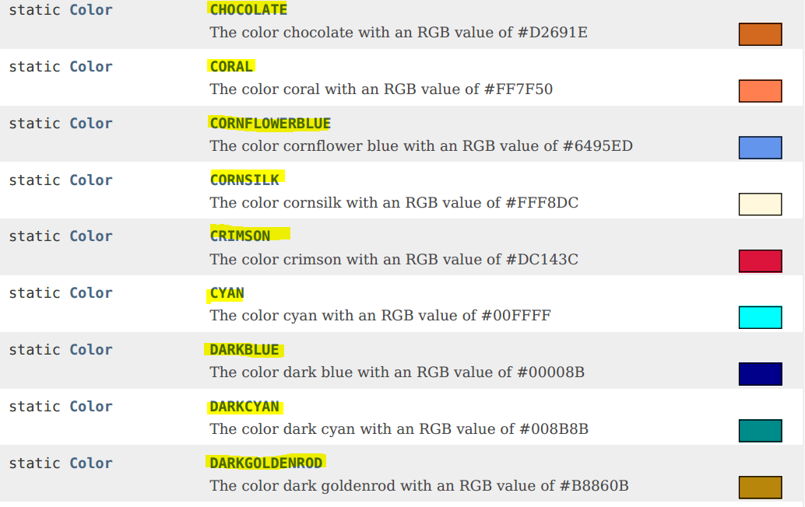

Introducing Colours

Colours are always appealing whether in real Life or in a GUI
application. By considering their importance, in this lesson we will
learn how to use colour to change the background colour of our Java FX
app. This is very basic use of colour in JFX but remember if you got
this technique then using colours in other cases will not be a much big
deal.

# ***The "Paint" sub-Package:*** ("javafx.scene.paint")

The package "***scene***" contains many sub-Packages one of which is
"***paint***". The sub package of Paint provides us the set of classes
for colours and gradients which are used to fill shapes and backgrounds
when working with the scene graph (scene) and nodes (controls).

For more information on sub-package "***paint***" please visit:

<https://docs.oracle.com/javase/8/javafx/api/javafx/scene/paint/package-summary.html>

# ***The "Color" Class:*** ("javafx.scene.paint.Color")

One of the most important class of Sub-package "***paint***" is
"***Colour***". It provides us Colours to use them in our Java FX app.
Thus if you want to use Colours in your Java FX application, you need to
use this import declaration:

***import javafx.scene.paint.Color;***

The Colour names are ***enumerations*** (***named constants***) declared
in class of "***Color***". In simple words, the names of colours
available in Java FX are stored in "***Color***" class. The general
statement to use a colour looks like as following:

***Color.colorName;***

Here "***Color***" is the class name which contains colours and
***colorName*** is the name of colour which you want to use.

For example: ***Color. RED***, ***Color. BLUE***, ***Color. GREEN***.

***Remember by convention, all constants are written in UPPERCASE
letters.***

To view the list of all Colours available in JFX visit:

<https://docs.oracle.com/javase/8/javafx/api/javafx/scene/paint/Color.html>

Some of the colours defined in class "Color" are:

{width="6.8259481627296585in"
height="3.1458333333333335in"}

# ***Demonstrating the use of Colours:***

Here we are going to change the background Colour of our First Java FX
Application.

import javafx.application.Application ;

import javafx.stage.Stage;

import javafx.scene.Scene;

import javafx.scene.layout.FlowPane;

// importing class of "Color"

import javafx.scene.paint.Color;

public class UsingColor extends Application {

public static void main (String \[\] args) {

launch (args);

} // end of main

public void start (Stage myStage) {

myStage.setTitle("Using Colors");

FlowPane rootNode = new FlowPane ();

> // create a scene from rootNode, set the width and height to 500 units
> and set the background color to "RED"

Scene myScene =

new Scene(rootNode,500,500,***Color.RED***);

myStage.setScene (myScene);

myStage.show ();

} // end of Start

} // end of class "UsingColor"

***Explanation:***

Notice this line:

Scene myScene = new Scene (rootNode, 500, 500, ***Color.RED***);

This line actually creates a scene from rootNode as done in previous
programs.

The new thing here is the fourth parameter to the constructor of
"***Scene***" class which takes a "***Color***" as an argument. So,
essentially this lines creates a Window with ***Red Background
colour***.

Similarly this line will create a window with Green Background color.

Scene myScene = new Scene(rootNode, 500, 500, ***Color.GREEN***);

# 

# ***Output:***

The output of the above program is given below:

> {width="3.8541666666666665in" height="3.625in"}
