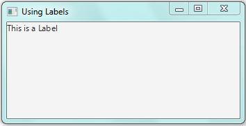
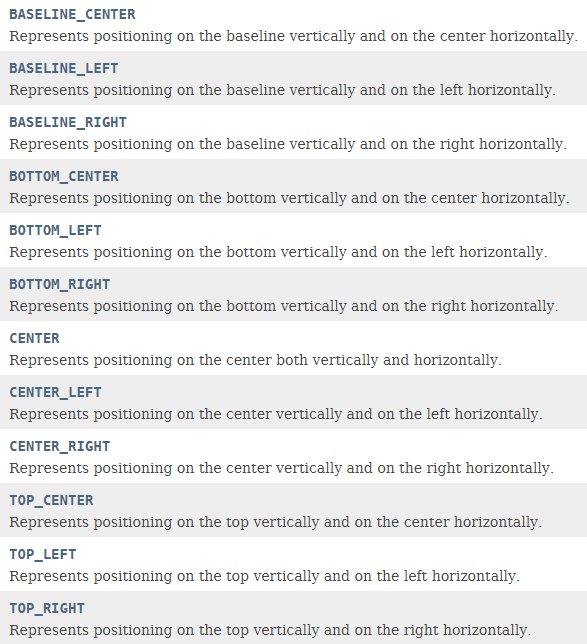
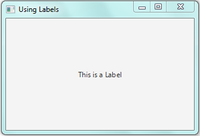

Introduction to Labels

# Labels:

Labels are type of a control which are used to give some message to the
user in a GUI application or they are used as a heading to display
information about different components of a Java FX application. They
are most commonly used JFX controls. They are also referred as ***child
nodes*** because they are added to a layout (***rootNode***).Whatever
the layout is, whether it is Flow Pane ,Grid Pane or Border Pane,
because they are added to these layouts they are called child Nodes and
the layout to which they are added is their ***Parent Node***. Recall
that JFX controls like Buttons, Scroll Panes and Menus etc. are found in
package of "***javafx.scene.control***". Similarly the class
***"Label"*** is also found in the package "***javafx.scene.control***".

The fully qualified class name of Label is:

***javafx.scene.control.Label;***

So, remember that if you want to use Labels in your JFX application,
don\`t forget to add this import statement in your program:

***import javafx.scene.control.Label;***

For the sake of simplicity, you can also use this import statement:

***Import javafx.scene.control.\*;***

The difference between these two is that the import statement with
"***\****" imports all the classes found in package
***javafx.scene.control***.

The Label class defines many constructors. But we will use the following
one:

***Label** labelName **= new Label (String** text **);***

Here *labelName* is the name which you want to give to your Label. Note
that this constructor takes a String parameter. Here *text* which is a
variable of type String specifies the message which you want to add to
your Label to display it in your JFX application.

Once Label is created, we have to add it to rootNode. This requires two
steps. First of all we determine that what child nodes are already
attached with the rootNode. Then to that list of child nodes, we add our
Label (or any other control which we want).

Following line of code is used to accomplish this task:

***rootNode.getChildren().add(**labelName**);***

Here *labelName* specifies the name of Label which you want to add to
the rootNode. Remember instead of *labelName* you can use any control
name like Buttons etc. which you want to add to the rootNode.

In Simple words, whatever the control is, if you want to add that
control to a rootNode first of all you will determine that what child
nodes are already attached with the rootNode. For this we call the
***getChildren()*** on rootNode which returns a List of all child nodes
attached to that rootNode. Then to this list of child nodes, we add our
control, in this case Label, through call to the method ***add()*** by
passing the names of controls to it, to add them to rootNode.

If there are more than one label or control which you want to add to the
rootNode then you can use ***addAll()*** method instead of add method.

***Don\`t forget to separate the names of controls by using commas when
calling** addAll() **method otherwise compilation error will occur***.

To use ***addAll()*** method you will have to use the following line of
code:

***rootNode.getChildren().addAll(**control1, control2, ......
,lastControl **);***

# Using Labels:

Now we will use preceding discussion to add Label to our JFX app.

import javafx.application.Application ;

import javafx.stage.Stage;

import javafx.scene.Scene;

import javafx.scene.layout.FlowPane;

// importing class "Label" to use Labels

**import javafx.scene.control.Label;**

public class MyLabel extends Application{

public static void main(String \[\]args){

launch (args);

} // end of main

public void start (Stage myStage){

myStage.setTitle("Using Labels");

FlowPane rootNode = new FlowPane();

Scene myScene = new Scene(rootNode,500,500);

**Label myLabel = new Label ("This is a Label");**

**rootNode.getChildren().add(myLabel);**

myStage.setScene(myScene);

myStage.show();

} // end of Start

} // end of class "MyLabel"

# Output:

The output of the above program is given below:

{width="3.6875in" height="1.8958333333333333in"}

Introducing Alignment of Controls

# Alignment:

Notice the output of previous program, our label is aligned toward the
top-Left corner of our JFX application window. What if we want to change
the alignment of our Label or any other controls like Buttons etc.? In
Simple words, what we have to do change the position of our controls in
a JFX application window?

# geometry.Pos: (javafx.geometry.Pos)

The answer to the question regarding changing the position of our
control in JFX app is given by an enumeration constant (named constants)
called ***POS*** ***short for position***. This is defined in the
package "***javafx.geometry.Pos***". It works similar to the enumeration
constant Color introduced in previous manual. In Simple words, POS
defines names of all the positions in a JFX window where you can place
your controls like Labels and Buttons.

To change the alignment of the child Nodes or controls belonging to a
rootNode, ***setAlignment()*** method is called on that root Node. The
general form of ***setAlignment()*** method is given below:

***void setAlignment(Pos** value**);***

Here value is the name of one of the position defined in
***geometry.Pos***. For example: ***setAlignment(**Pos.CENTER**); ***

Remember to use ***Pos***, you will have to include this import
declaration in your program:

***import javafx.geometry.Pos;***

The names of all the Positions defined by ***geometry.Pos*** are given
below:

{width="6.114583333333333in"
height="6.708333333333333in"}

# Aligning Labels:

Now we will use ***geometry.Pos*** to change the alignment of our Label
in our JFX app.

import javafx.application.Application ;

import javafx.stage.Stage;

import javafx.scene.Scene;

import javafx.scene.layout.FlowPane;

// importing class "Label" to use Labels

**import javafx.scene.control.Label;**

// importing "geometry.Pos"

**import javafx.geometry.Pos;**

public class UsingPos extends Application{

public static void main(String \[\]args){

launch (args);

} // end of main

public void start (Stage myStage){

myStage.setTitle("Aligning Labels");

FlowPane rootNode = new FlowPane();

Scene myScene = new Scene(rootNode,500,500);

**Label myLabel = new Label ("This is a Label");**

**rootNode.getChildren().add(myLabel);**

**rootNode.setAlignment(Pos.CENTER);**

myStage.setScene(myScene);

myStage.show();

} // end of Start

} // end of class "Using Pos"

# Output:

The output produced by the above program is given below:

{width="3.4895833333333335in"
height="2.3854166666666665in"}

***Explanation:***

Notice this line:

**rootNode.setAlignment(*Pos.CENTER*);**

This line actually aligns all the child nodes of a rootNode to
***Center***. This means that all of your child nodes attached to this
root Nodes will be automatically aligned towards ***Center***. Although
you can change the position of individual node. This is difficult to
explain that at this moment. We will learn the technique of changing the
position of individual nodes in upcoming lessons. At this moment just
remember this statement to align your controls.

Try using different ***Pos constants*** like the following and observe
the outputs:

**rootNode.setAlignment(*Pos.BASELINE_LEFT*);**

I recommend you to use all ***Pos Constants*** one by one and check the
output. The image containing the list of all ***Pos Constants*** can be
found on Page#7 of this document.
