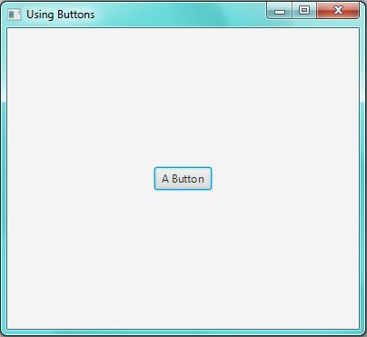
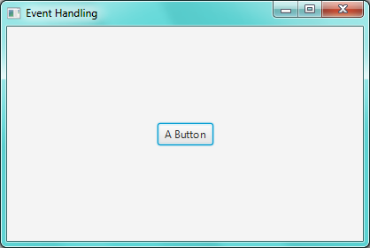
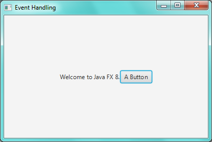

Introducing Buttons

# Buttons: 

In the last lesson we used labels to print out some message to the user
in out JFX app. Another important control or child node used in JFX 8 is
Button. They are used when we want that a certain action should be
performed when the button is pressed by the user. The "***Button***"
like classes of other controls is packaged in
***"javafx.scene.control.Button".*** Also, the procedure of adding a
button to the root node is same as we done with the label. Recall that
following line of code is used to add any type of control to the root
node:

***rootNode.getChildren ().add (**myButton**);***

Here ***myButton*** specifies the name of the button which you want to
add to the rootNode.

Of course, if you want to add more than two buttons to the root node you
can use the following line of code:

***rootNode.getChildren().addAll(**button1, button2,.......,
lastButton**);***

There are many types of Buttons like ***Push Buttons, Toggle Buttons and
Radio Buttons*** etc. But we will use push Buttons now and on the way
gradually we will learn all how to use other types of buttons in our JFX
app.

So, here is one thing to remember if you want to use buttons in your JFX
application that don\`t forget to add this import statement in your
program. Otherwise compiler might not be happy with you!!

***import javafx.scene.control.Button;***

Recall that you can also use this statement to import all the controls
in your application altogether:

***import javafx.scene.control.\*;***

Once you have imported the "Button" class, use following line of code to
create a button:

***Button** buttonName **= new Button (String** text)**;***

Here *buttonName* is the name which you want to give to your Button.
Here *text* is the message which will be displayed in the button, as you
will see very shortly.

# Using Buttons:

Let us add a button in our JFX app:

import javafx.application.Application ;

import javafx.stage.Stage;

import javafx.scene.Scene;

import javafx.scene.layout.FlowPane;

**import javafx.geometry.Pos;**

// importing class "Button" to use Buttons

**import javafx.scene.control.Button;**

public class MyButton extends Application{

public static void main(String \[\]args){

launch (args);

} // end of main

public void start (Stage myStage){

myStage.setTitle("Using Buttons");

FlowPane rootNode = new FlowPane();

Scene myScene = new Scene(rootNode,500,500);

**Button myButton = new Button("A Button");**

rootNode.getChildren().add(myButton);

**rootNode.setAlignment(Pos.CENTER);**

myStage.setScene(myScene);

myStage.show();

} // end of Start

} // end of class "MyButton"

# Output:

Note the output that we have created a button and aligned it in the
centre of the root Node:

{width="4.208333333333333in"
height="3.8645833333333335in"}

At this point, you might want to change the size of Button and customize
it in a way you want. Yes this is possible and we will also learn these
techniques in upcoming lessons.

Here is an amazing property of buttons that you can also add graphics
(images) to a button instead of a simple text message. We will learn
that technique too.

Note that the button which we have used in our JFX app (see output) is a
***"Push Button"*** which performs an action associated with that button
whenever user clicks on the button. This process is introduced in next
section and is called ***"Event Handling"***.

Introduction Event Handling

# Event Handling:

We have just created a push button but it was not much useful because
whenever we click that button it does nothing. To let buttons perform an
action whenever they are clicked by user we use a phenomenon called
***"Event Handling".*** All controls (including Buttons) have some
events associated with them like ***mouse click, mouse Hover, getting
Keyboard Focus for input and dragging*** etc. This means that we can
associate a task with an event of a control. So that whenever that event
is ***raised*** or ***fired*** on our control, the task attached with
that event must be performed.

To do this we have two approaches, ***anonymous inner classes*** and
***Lambda expressions.*** The first one is quite complicated to be
understood at this stage. So we will be using ***Lambda Expressions***
"**-\>**" for handling events raised by our controls.

The ***"Button"*** class defines a method known as ***setOnAction ();***
which performs an action declared in its body whenever the button is
clicked. It looks like following:

*buttonName***.setOnAction ((***actionName***) -\> {**

> /\* write your code here to perform the task or action you want to
> done whenever the button is clicked. Note: The symbol **"-\>"**
> denotes a lambda expression. \*/

**} );**

Here ***"buttonName"*** specifies the name of button on which you want
to call ***setOnAction ()*** method and ***actionName*** is the name of
action, which you have to give for your task as needed or as you want.

# Demonstrating Event Handling on Buttons:

Now we will create a little JFX application in which we will add a
button and an event to that button. So that whenever the button is
pressed it prints a welcome message using a Label. Here is the program
to do that:

import javafx.application.Application ;

import javafx.stage.Stage;

import javafx.scene.Scene;

import javafx.scene.layout.FlowPane;

**import javafx.geometry.Pos;**

**import javafx.scene.control.Label;**

// importing class "Button" to use Buttons

**import javafx.scene.control.Button;**

public class MyButton2 extends Application{

public static void main(String \[\]args){

launch (args);

} // end of main

public void start (Stage myStage){

myStage.setTitle("Event Handling");

FlowPane rootNode = new FlowPane();

Scene myScene = new Scene(rootNode,500,500);

**Button myButton = new Button("A Button");**

**Label myLabel = new Label("");**

**rootNode.getChildren().addAll(myLabel,myButton);**

**rootNode.setAlignment(Pos.CENTER);**

**myButton.setOnAction((myAction) -\>{**

**myLabel.setText("Welcome to Java FX 8.");**

**});**

myStage.setScene(myScene);

myStage.show();

} // end of Start

} // end of class "MyButton2"

# Explanation:

Notice that in this program we created a Label with an empty (string or)
message using this statement:

**Label myLabel = new Label ("");**

And we changed the text message of Label when button was pressed using
the function ***"setText (String** text**)"*** which receives a String
as an input argument as shown in following line of code:

**myLabel.setText ("Welcome to Java FX 8.");**

Essentially, following lines of codes are of due importance in the
preceding program.

**rootNode.setAlignment (Pos.CENTER);**

**myButton.setOnAction ((myAction) -\> {**

**myLabel.setText ("Welcome to Java FX 8.");**

**});**

Initially, when the application will be started it will just show us a
button and when we will press that button, it will print a message.
Although the output of this program is not much cleaner but it provides
a useful and easier way to understand Event Handling.

Once you will master the basics then rest of the customization is not a
difficult task.

# Output:

The output produced by the program is shown below:

***(Initially, before pressing the button)***

{width="4.354166666666667in"
height="2.9166666666666665in"}

***(After pressing the button)***

{width="4.354166666666667in"
height="2.9166666666666665in"}
