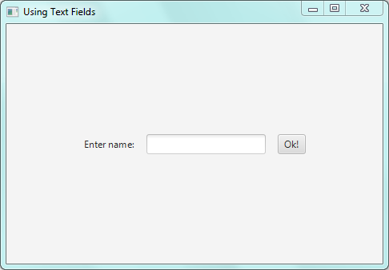
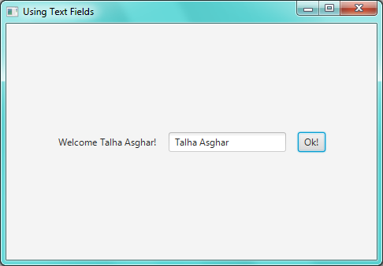
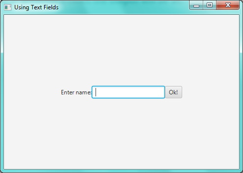
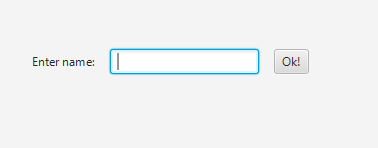

Introduction to Text Fields

# **Text Fields:**

*Text Fields* are as much important as the Labels are. These two
controls play an important role in a JFX app because as the Labels to
output message. On Contrast, ***Text Fields are used to take input from
user***. The search bar you use to search something on Google is the
most common example of Text Field.

{width="5.708333333333333in"
height="0.6376060804899387in"}

Like other controls, the class of Text Field is also packaged in
**"*javafx.scene.control"*** and its full qualified class name is
**"*javafx.scene.control.TextField".***

This means to use Text Field in your program you need must have to add
this import statement in your program

***import javafx.scene.control.TextField;***

# **Creating a Text Field:**

To create a Text Field we will use the following constructor defined in
the class ***Text Field*** as shown below:

**TextField** *myField* **= new TextField();**

This line creates a Text Field named as ***myField*** which is ready to
be used in our application.

Before moving forward, it is important to remember that ***Text Field is
used in a same manner as other control like Button or Label is used in a
JFX app.***

# Using Text Fields:

Let\`s create our first Text Field. In this program, we will input the
name of user by using Text Field and then print a welcome message by
using techniques learned in previous lessons.

import javafx.application.Application ;

import javafx.stage.Stage;

import javafx.scene.Scene;

import javafx.scene.layout.FlowPane;

import javafx.geometry.Pos;

*// importing classes of "Label" and "Button"*

import javafx.scene.control.Label;

import javafx.scene.control.Button;

*// importing class "TextField" to use TextFields*

**import javafx.scene.control.TextField;**

public class myField extends Application{

public static void main(String \[\]args){

launch (args);

} // end of main

public void start (Stage myStage){

myStage.setTitle("Using Text Fields");

FlowPane rootNode = **new FlowPane(15,15);**

Scene myScene = new Scene(rootNode,500,500);

Label myLabel = new Label ("Enter name:");

Button myButton = new Button ("Ok!");

**TextField myField = new TextField();**

rootNode.getChildren().addAll(myLabel,myField, myButton);

rootNode.setAlignment(Pos.CENTER);

**myButton.setOnAction((myAction) -\>{**

**String name = myField.getText();**

**myLabel.setText(\"Welcome \" + name + "!");**

**});**

myStage.setScene(myScene);

myStage.show();

} // end of Start

} // end of class "myField"

# Output:

The output of the above program is given below:

{width="5.0625in" height="3.5208333333333335in"}

{width="5.0625in" height="3.5208333333333335in"}

# **Explanation:**

Although this program uses much of the techniques described in previous
lessons but here are some new things to be discussed:

First of all, notice this line:

FlowPane rootNode = **new FlowPane (15, 15);**

In this line*, we are creating the rootNode from Flow Pane with the
Horizontal and Vertical gap of 15 units (pixels or cm etc.) among all
the child nodes attached with the rootNode*. If we don\`t pass any
argument to the constructor of Flow Pane as done in previous lessons the
output will be as:

{width="5.15625in" height="3.6666666666666665in"}

(Note that there is no space between Label, Text Field and Button.)

After creating root Node, we have created a Label with text ***"Enter
name"*** and also an ***"Ok!"*** Button.

A Text Field has been created in the program (to get user input) as
illustrated in beginning of this lesson. Then we attached all of our
controls with the root Node by following line of code as done in
previous lessons:

**rootNode.getChildren().addAll(myLabel,myField, myButton);**

After that we are handling the "click" event of our button to perform
two tasks. In simple words, when our ***"Ok"*** Button is pressed, we
are doing two things. First, to get the input, entered by user in the
Text Field. This is done by calling following function:

**String** *name* **=** *myField***.getText();**

The ***getText()*** method of class ***Text Field*** returns the string
entered by user in the Text Field. So, the above line of code stores
that string into a String variable called ***name***.

The second thing (which is done when button is pressed) is to print a
welcome message in our Label using the input data obtained through Text
Field. This is done by changing the text of our Label because recall
that when we created our Label it looked like as shown below:

{width="3.9375in" height="1.5416666666666667in"}

To change the text we used the ***setText()*** method of class
***Label*** as following:

*myLabel***.setText(\"Welcome \" + name + "!");**

This line prints Welcome message to the user whose name is stored in
String variable name.

Thus, by combining these two things, when a button is pressed following
lines of codes are executed:

**myButton.setOnAction((myAction) -\>{**

**String name = myField.getText();**

**myLabel.setText(\"Welcome \" + name + "!");**

**});**

First line (inside function ***setOnAction***) obtains the input data
from Text Field and second line prints it as a welcome message.
